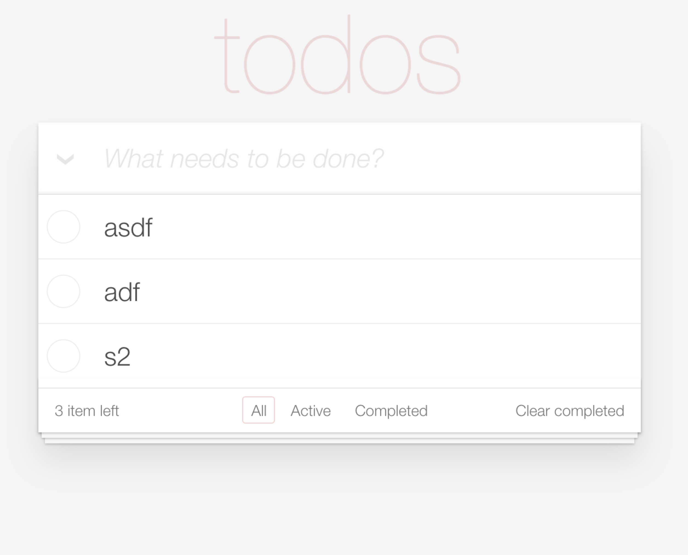

# Deku Todo

This is a todo example written in Deku v2

[Demo here](https://jjvvv.github.io/deku-todo/)

<div align="center">
	<a href="https://jjvvv.github.io/deku-todo/" align="center">
		
	</a>
</div>

## Usage

```
npm install

npm start
```

## Thanks
* [Redux Todos Example](http://redux.js.org/docs/basics/ExampleTodoList.html)

## License

MIC


